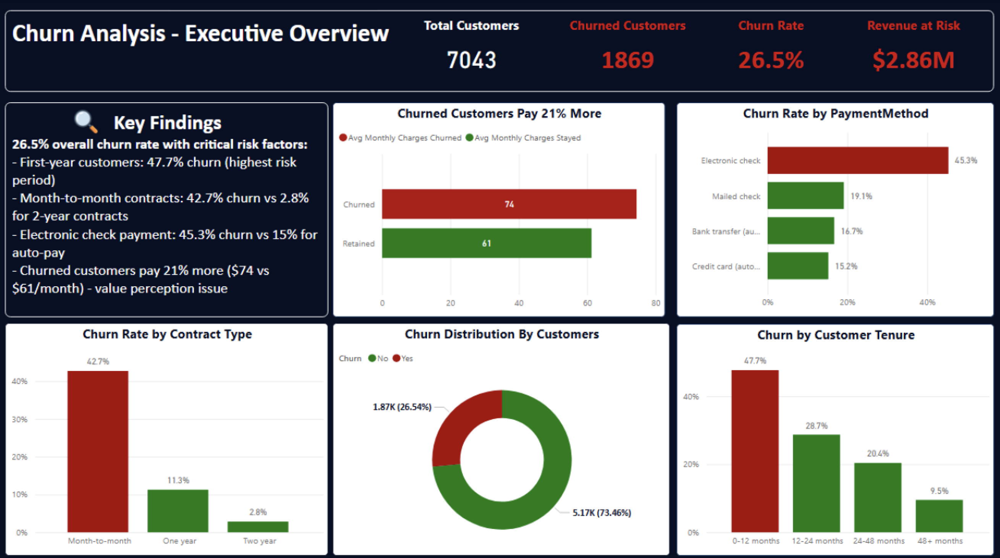
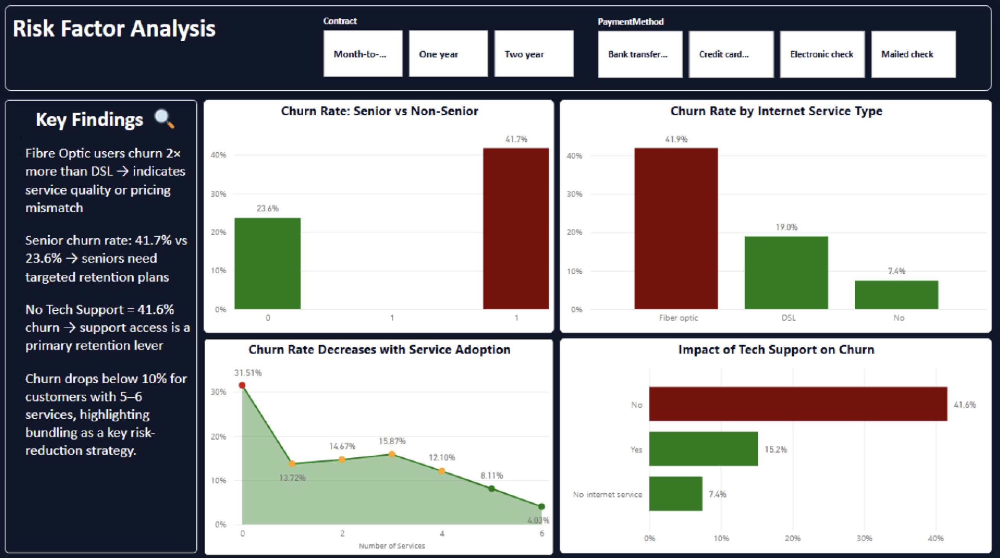
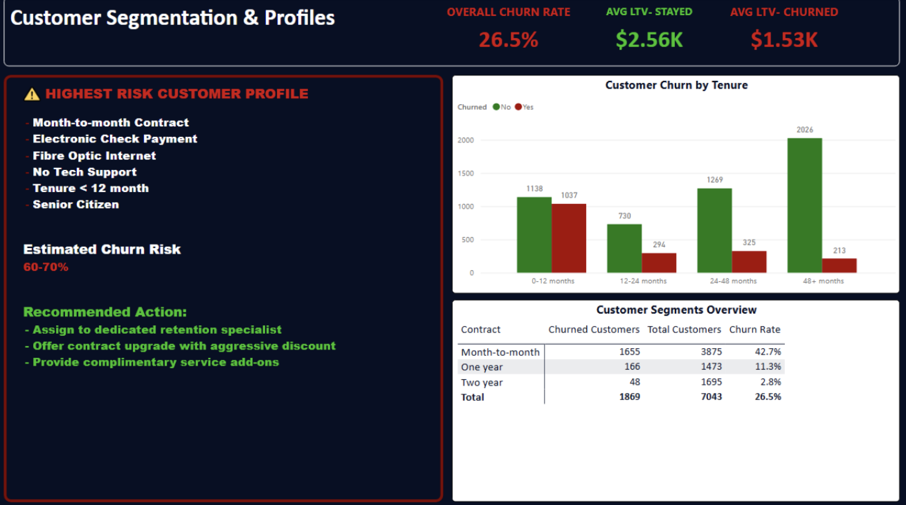
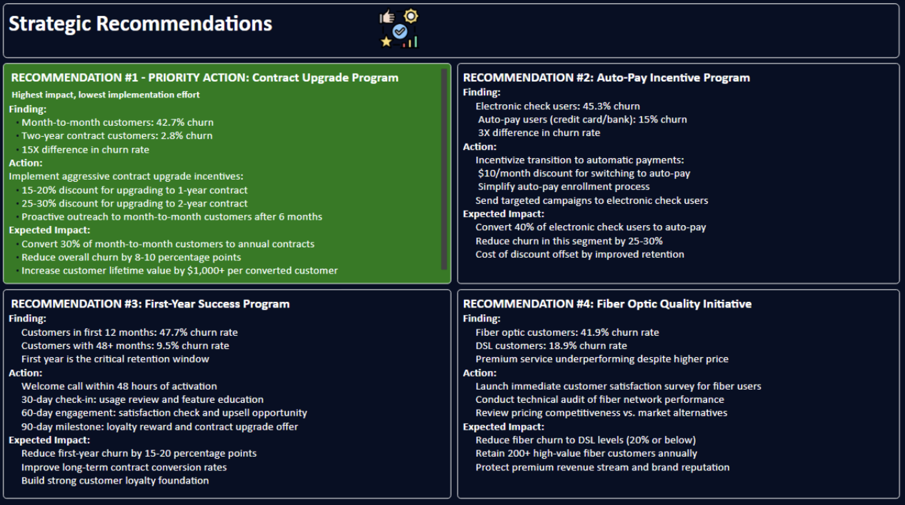

# 📊 Customer Churn Analysis

End-to-end analysis of customer churn patterns, identifying key risk factors and providing data-driven retention strategies.



---

## 🎯 Project Overview

- **Total Customers**: 7,043
- **Churned Customers**: 1,869 (26.5%)
- **Revenue at Risk**: $2.86M
- **Churn Rate**: 26.5%

---

## 📈 Key Findings

1. **Contract Type Impact**: Month-to-month customers show 42.7% churn vs 2.8% for 2-year contracts (15X difference)
2. **Payment Method Risk**: Electronic check users have 45.3% churn vs 15% for auto-pay users (3X difference)
3. **Critical First Year**: 47.7% of customers churn within first 12 months
4. **Service Quality Gap**: Fiber optic customers churn at 41.9% vs 19% for DSL
5. **Value Perception Issue**: Churned customers paid 21% more ($74 vs $61/month)

### Highest Risk Profile
Customers with the following characteristics have 60-70% churn probability:
- Month-to-month contract
- Electronic check payment
- Fiber optic internet
- No tech support
- Tenure < 12 months
- Senior citizen

---

## 💡 Strategic Recommendations

### 1. Contract Upgrade Program (PRIORITY ACTION)
- **Target**: Month-to-month customers (42.7% churn)
- **Action**: 15-20% discount for 1-year upgrades, 25-30% for 2-year
- **Expected Impact**: Convert 30% to annual contracts, reduce churn by 8-10%

### 2. Auto-Pay Incentive Program
- **Target**: Electronic check users (45.3% churn)
- **Action**: $10/month discount for switching to auto-pay
- **Expected Impact**: Convert 40% to auto-pay, reduce segment churn by 25-30%

### 3. First-Year Success Program
- **Target**: Customers in first 12 months (47.7% churn)
- **Action**: Welcome calls, 30/60/90-day check-ins, loyalty rewards
- **Expected Impact**: Reduce first-year churn by 15-20 percentage points

### 4. Fiber Optic Quality Initiative
- **Target**: Fiber customers (41.9% churn)
- **Action**: Satisfaction surveys, technical audits, pricing review
- **Expected Impact**: Reduce fiber churn to DSL levels (~20%)

---

## 🛠️ Tools & Technologies

- **Python (Anaconda)**: Data cleaning, transformation, and exploratory analysis
  - pandas, numpy, matplotlib, seaborn
- **Power BI**: Interactive dashboards, DAX measures, data modeling
- **Data Source**: Kaggle Customer Churn Dataset

---

## 📂 Project Structure
```
customer-churn-analysis/
├── data/                  # Raw and cleaned datasets
├── notebooks/             # Jupyter notebook with Python analysis
├── powerbi/              # Power BI dashboard file (.pbix)
└── images/               # Dashboard screenshots
```

---

## 🚀 How to Use

1. **Clone the repository**
```bash
   git clone https://github.com/tesseffectz/customer-churn-analysis.git
```

2. **Explore the Python analysis**
   - Open the Jupyter notebook in `/notebooks`
   - Review data cleaning and EDA process

3. **View the dashboard**
   - Open the `.pbix` file in Power BI Desktop
   - Interact with the visualizations

---

## 📊 Dashboard Previews

### Executive Overview


### Risk Factor Analysis


### Customer Segmentation


### Strategic Recommendations


---

## 👨‍💼 About Me

**Teslim Thomas**  
Business Analytics Student

Passionate about turning data into actionable insights and solving real-world business problems through analytics.

---

## 📧 Connect With Me

- **LinkedIn**:  https://www.linkedin.com/in/teslim-thomas-9b844019a
- **Email**: teslimthomas23@gmail.com

---

## 📝 License

This project is for portfolio and educational demonstration purposes.

---

⭐ **If you found this analysis valuable, please consider giving it a star!**
